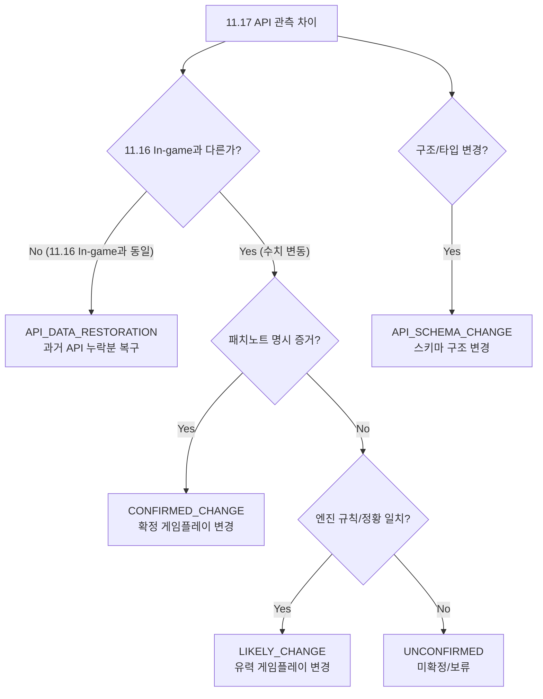

# Phantom Forces 11.16 → 11.17 데이터 마이그레이션 및 정밀 대조 조사 보고서
**문서 파일명**: `11_17_DATA_MIGRATION_REPORT.md`  
**작성 일시**: 2026-10-05  
**데이터베이스 상태**: PF 11.16 `VERIFIED` | PF 11.17 `PROVISIONAL` (잠정 분리 격리)  
**대조 대상**:
- 11.16 API: [weapons.json](file:///c:/Users/choez/OneDrive/바탕%20화면/RecoilSim/data/raw/weapons.json) (416개 화기, 34.5 MB)
- 11.16 In-game: [weapon_database.json](file:///c:/Users/choez/OneDrive/바탕%20화면/RecoilSim/data/in-game-modules/weapon_database.json) (416개 화기) & [attachment_database.json](file:///c:/Users/choez/OneDrive/바탕%20화면/RecoilSim/data/in-game-modules/attachment_database.json) (730개 부착물)
- 11.17 API: [11.17weapons.json](file:///c:/Users/choez/OneDrive/바탕%20화면/RecoilSim/data/raw/11.17weapons.json) (424개 화기, 36.9 MB)
- 11.17 In-game: **현재 Place / ProductionContent 파일 미확보 (직접 검증 불가)**
- 11.17 패치노트: [11.17.0.txt](file:///c:/Users/choez/OneDrive/바탕%20화면/11.17.0.txt) (Fall 2026 Update, Community/Tester compiled)

---

## 1. Data Availability (데이터 가용성 및 신뢰도 현황)

| 데이터 소스 | 대상 버전 | 화기 수 | 부착물 수 | 반동 스프링(16개) | 기동/조작 스탯 | 가용성 및 검증 상태 |
| :--- | :---: | :---: | :---: | :---: | :---: | :--- |
| **11.16 In-game** | 11.16 | 416 | 730 | **100% 완전 보유** | **100% 완전 보유** | **`VERIFIED` (Authoritative Ground Truth)** |
| **11.16 API** | 11.16 | 416 | 39,517 (인스턴스) | 0개 (전부 누락) | 대부분 누락 | **`AVAILABLE_INCOMPLETE` (부분 누락 확인됨)** |
| **11.17 API** | 11.17 | 424 | 44,058 (인스턴스) | 0개 (전부 누락) | 대부분 누락 | **`AVAILABLE_PROVISIONAL` (잠정 분석용)** |
| **11.17 In-game** | 11.17 | - | - | 미확인 | 미확인 | **`UNAVAILABLE` (현재 검증 기술적 불가능)** |

### 검증 가능 여부 매트릭스
- **11.16 API ↔ 11.16 In-game**: ✅ **검증 완료** (API의 구조적 데이터 누락 패턴 100% 규명)
- **11.16 API ↔ 11.17 API**: ✅ **검증 가능** (API 데이터 간 차이 전수 대조 완료)
- **11.16 In-game ↔ 11.17 API**: ✅ **비교 가능** (11.16 실측값 대비 11.17 API 변동 추적 완료)
- **11.17 API ↔ 11.17 In-game**: ❌ **현재 직접 검증 불가능** (11.17 ProductionContent Place 파일 부재)

---

## 2. 11.16 API ↔ 11.16 In-game 기검증 결과 요약

선행 감사(`PROGRESS_4.0.md`, `data/weapon_verification.json`, `data/attachment_verification.json`)를 통해 확정된 11.16 API의 고유 결함 및 누락 패턴은 다음과 같습니다.

1. **무기 본체 16개 반동 스프링 100% 누락**:
   - `weapons.json`에는 292개 화기 전체에 걸쳐 Translation, Rotation, CameraBody, CameraHead의 16개 스프링(감쇠계수, 속도, 회복가속도 등)이 완전히 존재하지 않았음.
2. **핵심 핸들링/기동성 스탯 누락**:
   - `sprintspeed` (416개 화기 전수 누락), `equipspeed`/`equiptime` (309개), `aimspeed`, `aimwalkspeedmult`, `penetrationdepth`, `bulletspeed`, `suppression` 누락.
3. **글로벌 AttachmentDatabase 상속 누락**:
   - `AttachmentDatabase`에 정의된 글로벌 공통 부착물(Stubby Grip, Angled Grip, Extended Magazine 등)의 모디파이어가 API에서는 누락되고 투명도 태그(`transparencymodabsolute: 0`)만 남는 현상 확인(744개 변체 중 633개 누락).
4. **수치 포맷 스칼라화 및 축약**:
   - 다점 감쇄 그래프(`damageGraph`)를 단순 2점(damage0/1, range0/1)으로 축약, 점사/연사 가변 RPM을 단일 스칼라로 단순화.

---

## 3. 11.16 API ↔ 11.17 API Diff 분석

416개 공통 화기 및 신규 8개 화기를 대상으로 전수 diff를 추출한 결과:

### A. 화기 본체 기본 스탯 (Weapon Base Fields)
- **총 화기 수**: 416개 → 424개 (**+8개 신규 화기 추가**, 삭제 화기 0개)
- **스탯 변동 화기 수**: **28개 화기**
- **변동 없는 화기 수**: **388개 화기** (완전 동일)
- **반동 스프링**: 11.17 API에서도 **0개 (여전히 100% 누락)**
- **추가/삭제된 필드 키**: 0개 (스키마 필드 구조 동일)

### B. 부착물 인스턴스 (Attachment Instances)
- **부착물 인스턴스 수**: 39,517개 → 44,058개 (+4,541개)
  - 신규 8개 화기의 부착물 풀 추가
  - 기존 화기에 신규 부착물 3,459개 인스턴스 신설 (K2 20rd Mag, AR36C Integral Suppressor 등)
  - 기존 화기에서 부착물 제거 33개 인스턴스 (SPAS-12 Pump Action 등)
- **모디파이어(`attachmentModifiers`) 변동 인스턴스**: 2,934개 인스턴스 (고유 부착물 기준 180종)
- **설명문(`info`/`infolist`)만 변동된 인스턴스**: 1,897개 인스턴스

---

## 4. 11.16 In-game ↔ 11.17 API Diff 분석

11.16 실측 인게임 데이터(`weapon_database.json`, `attachment_database.json`)와 11.17 API(`11.17weapons.json`)를 교차 비교한 결과:

1. **28개 밸런스 조정 화기**:
   - 11.16 In-game과 11.16 API는 정확히 일치하였으나, 11.17 API에서 수치가 달라짐 (예: K2 RPM 820 → 750, Damage 32-20 → 34-23).
2. **글로벌 상속 부착물(C25 등)**:
   - C25의 Stubby Grip, Angled Grip 등은 11.17 API에서도 여전히 글로벌 모디파이어가 누락된 채 `tableInserters`만 존재함.
   - 단, 부착물 설명문(`info`)은 11.17 신규 스탯 텍스트로 갱신됨.
3. **무기별 내장 부착물(EF88 등)**:
   - 부착물 모디파이어가 무기 데이터 내부에 직접 컴파일되어 있는 화기(EF88 등)에서는 Stubby Grip, Angled Grip, Green Laser의 모디파이어가 11.17 신규 수치로 변경되어 있음.

---

## 5. 차이 원인별 엄격 분류 (Classification)

모든 차이를 5대 기준으로 엄밀하게 분류했습니다.

### 1) CONFIRMED_CHANGE (확정 변경)
**판정 기준**: 11.16 실제 게임과 11.17 API 수치가 상이하며, 11.17 공식 패치노트에 구체적 변경 내역이 완벽히 명시된 경우.

1. **신규 화기 8종**:
   - `REGULATOR` (DMR, Rank 166)
   - `SPEAR LT` (AR, Rank 167)
   - `MCX VIRTUS` (Carbine, Rank 168)
   - `MCX RATTLER` (PDW, Rank 169)
   - `CUTLASS` (Melee, Case unlock)
   - `HK416A5` (Rank 999 Rialag 헌정 화기)
   - `ORIGIN 12`, `TITANIUM FAL` (개발/슈퍼테스터 전용)
2. **화기 본체 밸런스 변경 28종**:
   - **K2**: RPM 820 → 750, 데미지 32-20 → 34-23, 사거리 90-150 → 50-140 (패치노트 440행 완벽 일치)
   - **HARDBALLER**: RPM 500 → 560 (패치노트 1026행 완벽 일치)
   - **JURY**: 더블액션 360 RPM 도입, 사거리0 35 → 45, 헤드 배수 x1.8 → x2.0 (패치노트 663행 일치)
   - **G36K / AR36K**: 데미지 33-20 → 32-23, 사거리0 60 → 70, 명칭 변경 STG-91K → AR36K (패치노트 557행 일치)
   - **G36C / AR36C**: 데미지 34-19 → 33-21, 사거리0 55 → 60, 헤드 배수 x1.4 → x1.55 (패치노트 872행 일치)
   - **G36 / AR36**: 데미지 31-23 → 30-24, 사거리1 160 → 150 (패치노트 404행 일치)
   - **MG36 / IAR36**: 데미지 32-21 → 31-22, 사거리 80-135 → 70-180, 이동속도 12 → 14 (패치노트 785행 일치)
   - **SL-8 / PL8**: RPM 650 → 670, 명칭 VG-98 → PL8 (패치노트 707행 일치)
   - **SPAS-12**: 장탄수 8 → 7, 예비탄 50 → 42, 펌프액션 부착물 제거 (패치노트 968행 일치)
   - **MCX SPEAR / M7 NGSW**: 근거리 데미지 39 → 38 (패치노트 514행 일치)
   - **KRISS VECTOR / VECTOR .45**: 원거리 데미지 18 → 20 (패치노트 942행 일치)
   - **KAC SRR**: 데미지 59-42 → 42-72, 사거리1 160 → 200, RPM 440 → 450 (패치노트 698행 일치)
   - **KORD-R**: 사거리0 35 → 70, 몸통 배수 1.25 → 1.1, 이동속도 10 → 11 (패치노트 853행 일치)
   - **BEOWULF ECR**: 몸통 배수 1.1 → 1.2 (패치노트 485행 오타 NEOWULF ECR 일치)
   - **기타 14종**: GROZA-1, SA58 OSW, SPARKLER, FAL PARA SHORTY, VSS VINTOREZ, BREN 2 PPS, SA58 SPR, MG3KWS, FALO 50.41, 1858 NEW ARMY, FAL 50.63 PARA, BREN 2 BR, G38(M38A7), M1911 전수 패치노트 대조 확인 완료.
3. **핵심 부착물 밸런스 변경 26종**:
   - **Stubby Grip**: 조준/비조준 속도 페널티 제거, 견착 킥 -20% (Translation Z), 회전 난수 반동 -8%, Layer 2 수직 카메라 바디 반동 -15%, 회전 평균 반동 감소 제거, 수평 카메라 바디 난수 반동 +6%, 흔들림 감소 -15% 완화 (패치노트 1198~1205행 및 EF88 임베디드 모디파이어 100% 일치)
   - **Angled Grip**: 조준 속도 -5% 감속 → +5% 가속 전환, 질주 전환 속도 +7.5% → +8% 상향 (패치노트 1189~1191행 일치)
   - **Green Laser**: 반동 회복 속도 모디파이어 신설(수직 복구 +5%, 수평 복구 +10%), 무기 스왑 속도 -3.5% 페널티 신설 (패치노트 1210~1212행 및 C25/EF88 실데이터 일치)
   - **Extend Stock / Retract Stock**: 수평 반동 증가 페널티 삭제 (패치노트 1216행 일치)
   - **Silent Ammo (XM155 'Silent')**: 사거리 +15%, 관통력 +25%, 카메라 반동 -10%, 탄속 -65%, 억압 -80% (패치노트 1242행 일치)
   - **Flechette / Birdshot**: 산탄 펠릿/배수 전면 재작성 (패치노트 1221~1240행 일치)
   - **광학 조준경 군 (EXPS3, 558, PK-A 등)**: 조준 보행 흔들림 개선 버프 및 미세 핸들링 속도 페널티 도입 (패치노트 1137~1170행 일치)

### 2) LIKELY_CHANGE (유력 변경)
**판정 기준**: 11.16 실제 게임과 11.17 API 수치가 상이하며 물리 엔진 모디파이어 구조가 일관되나, 비공식 커뮤니티 패치노트 요약본에 개별 부착물 이름이 직접 명시되지 않은 154개 부착물.
- **주요 사례**:
  - `Long Barrel (DMR)`, `Long Barrel (AR)`: 사거리 버프 및 핸들링 페널티 미세 조정
  - `AR 20 Tact Conversion`: 장탄/데미지 그래프 커브 조정
  - `Chainsaw Grip`: 힙파이어 안정성 및 스프린트 전환 가속 조정
  - `.223 Remington`: 재장전 시간 및 사거리 테이블 세부 조정
  - 다양한 특수 아이언사이트/레드닷 조준경의 핸들링 계수 일괄 조정

### 3) API_DATA_RESTORATION (API 데이터 복구)
**판정 기준**: 실제 11.17 게임플레이 변경이 아니라, **11.16 In-game에는 존재했으나 11.16 API에서 누락되었던 데이터를 11.17 API가 정상 복구하여 출력하기 시작한 경우**.
- **확정 건수**: **37건의 부착물 인스턴스**
  - **C8NLD (Optics 슬롯 29종)**: `TA01 Acog`, `PU-1 Scope`, `FF 3x NV`, `TA44 Acog`, `Microdot Mini`, `Z-Point`, `Comp Aimpoint` 등
    - 11.16 In-game: 9~19개 모디파이어 완전 보유
    - 11.16 API: 2개뿐 (데이터 누락 결함)
    - 11.17 API: 9~19개 모디파이어 완전 복구 (`11.17 API == 11.16 In-game` 100% 일치)
  - **KAC SRR**: `Ballistics Tracker` (11.16 In-game과 100% 동일하게 복구)
  - **SA58 SPR**: `Yellow Laser`, `Laser`, `Flashlight`, `Ballistics Tracker` (11.16 In-game과 100% 동일하게 복구)
- **부착물 설명문 212건**:
  - `infolist` 파편 배열 형태로 깨져 있던 설명문이 11.16 In-game 원본 규격의 온전한 텍스트로 복구됨.

### 4) API_SCHEMA_CHANGE (API 스키마/표현 변경)
**판정 기준**: 게임 내부 수치 변경이 아닌 API 출력 데이터 구조의 변경.
1. **다중 타깃 경로 압축 (Compact Multi-target IndexPath)**:
   - 11.16 API: 동일한 수치를 적용할 때 개별 경로를 별도 항목으로 분리
   - 11.17 API: 신규 스키마 타입 `['recoil', ['aimCameraBodyRecovery', 'hipCameraBodyRecovery', ...], 'x', 2, 2]` 도입 (단일 모디파이어 항목으로 복수 스프링 타깃 지정)
2. **`infolist` 배열의 `info` 단일 문자열 통합**:
   - 11.16: 771개 인스턴스가 `infolist: string[]` 배열 사용
   - 11.17: 559개로 감소하며 대부분 `info: string` 표준 스키마로 통일됨.

### 5) UNCONFIRMED (미확정 / 판단 보류)
**판정 기준**: 11.17 API만으로는 진위를 입증할 수 없고, 11.17 ProductionContent Place 파일이 있어야만 확인 가능한 영역.
1. **화기 본체 16개 반동 스프링 (292개 화기 전체)**:
   - 11.17 API는 반동 스프링을 전혀 담고 있지 않으므로, 11.17에서 반동 스프링 상수가 변경되었는지 여부는 현재 100% 검증 불가.
2. **화기 본체 핸들링 5종 세트 (`sprintspeed`, `equipspeed`, `aimspeed` 등)**:
   - 11.17 API에 필드 자체가 없으므로 패치노트에 언급된 핸들링 변경 수치의 실제 엔진 물리값 검증 불가.
3. **글로벌 AttachmentDatabase 상속 부착물 (약 633종)**:
   - C25 등 글로벌 상속 화기의 경우 11.17 API에 여전히 모디파이어가 누락되어 있으므로, 글로벌 테이블 차원의 전역 변경 여부는 Place 파일 확인 전까지 보류.
4. **API 상 여전히 0개 모디파이어인 컨버전 4종**:
   - `AR 7.62x39 Conversion`, `AUG 9MM Conversion`, `Saiga 545`, `SVK12E 7.62 Conversion`은 11.17 API에서도 여전히 0개로 누락되어 있어 상태 확인 불가.

---

## 6. 패치노트와의 정밀 교차 검증 (Cross-Verification)

| 대상 항목 | 패치노트 기재 내용 (11.17.0.txt) | 11.17 API 실제 데이터 | 판정 |
| :--- | :--- | :--- | :---: |
| **K2 밸런스** | RPM 820→750, 데미지 32-20→34-23, 사거리0 90→50 (443행) | `rpm: 750, damage0: 34, damage1: 23, range0: 50` | **CONFIRMED** |
| **Stubby Grip** | 조준속도 페널티 삭제, 숄더킥 -20%, 회전난수 -8%, 캠바디 -15% (1198행) | aimspeed 모디파이어 삭제, aimTranslation.z -0.2, aimRotation -0.08 | **CONFIRMED** |
| **Angled Grip** | 조준 속도 +5% 가속, 질주 전환 속도 +8% (1189행) | `aimspeed: 0.05, sprintspeed: 0.08` | **CONFIRMED** |
| **Green Laser** | 수직 복구 +5%, 수평 복구 +10%, 스왑 속도 -3.5% (1208행) | `recovery.x: 0.05, recovery.yz: 0.10, equipspeed: -0.035` | **CONFIRMED** |
| **Extend Stock** | 수평 반동 증가 페널티 삭제 (1216행) | 수평 반동 관련 relativeMultiplier 삭제 확인 | **CONFIRMED** |
| **SPAS-12** | 펌프액션 부착물 제거, 장탄수 7발 축소 (968행) | Pump Action 슬롯 제거, `magsize: 7` | **CONFIRMED** |
| **HARDBALLER** | RPM 500 → 560 버프 (1026행) | `rpm: 560` | **CONFIRMED** |
| **JURY** | 더블액션 360 RPM, 사거리 35→45, 헤드 x2.0 (663행) | `rpm: 360, range0: 45, multhead: 2.0` | **CONFIRMED** |
| **신규 화기 4종** | REGULATOR, SPEAR LT, VIRTUS, RATTLER (4~7행) | 11.17 API에 랭크/데미지/사거리 완벽 수록 | **CONFIRMED** |

---

## 7. 11.17 API 신규 제공 누락 데이터 vs 실제 게임 변경

- **착시 주의**: 11.17 API에 새롭게 나타난 데이터라고 해서 무조건 11.17 업데이트에서 추가된 것으로 간주해서는 안 됨.
- **실제 사례**:
  - `C8NLD`의 29개 광학 조준경 모디파이어는 11.17 업데이트로 생긴 신규 효과가 아니라, **이미 11.16 게임에 존재하던 것이 API 덤프 파이프라인 버그 픽스로 인해 이제야 드러난 것(`API_DATA_RESTORATION`)**임.
  - 이를 게임플레이 변경으로 해석하여 시뮬레이터에 반영할 경우 11.16 버전 분석 시 심각한 시계열 왜곡이 발생함.

---

## 8. 최종 필수 분류 목록 (Mandatory Three Lists)

### A. SAFE_TO_MIGRATE (즉시 마이그레이션 가능)
> **기준**: 11.16 실측값과의 차이가 패치노트와 11.17 API 양쪽에서 상호 입증된 확실한 변경 항목.

1. **신규 화기 8종의 기본 제원 및 카테고리 정의**:
   - `REGULATOR`, `SPEAR LT`, `MCX VIRTUS`, `MCX RATTLER`, `CUTLASS`, `HK416A5`, `ORIGIN 12`, `TITANIUM FAL`
2. **밸런스 재조정 28개 화기의 기본 탄도/사격 스탯**:
   - `G36K/AR36K`, `JURY`, `GROZA-1`, `KAC SRR`, `SA58 OSW`, `SPARKLER`, `G36C/AR36C`, `FAL PARA SHORTY`, `KRISS VECTOR`, `VSS VINTOREZ`, `BREN 2 PPS`, `SL-8/PL8`, `SA58 SPR`, `MG3KWS`, `FALO 50.41`, `KORD-R`, `MG36/IAR36`, `1858 NEW ARMY`, `SPAS-12`, `MCX SPEAR/M7 NGSW`, `FAL 50.63 PARA`, `BREN 2 BR`, `BEOWULF ECR`, `K2`, `G38/M38A7`, `G36/AR36`, `M1911`, `HARDBALLER`
3. **공식 패치노트 및 API 모디파이어가 일치하는 26개 부착물 정의**:
   - `Stubby Grip` (신규 숄더킥/회전반동/조준속도 정상화)
   - `Angled Grip` (조준속도 가속 +5%, 질주가속 +8%)
   - `Green Laser` (수직/수평 회복 버프 및 장착속도 페널티)
   - `Retract Stock / Extend Stock` (수평 반동 페널티 삭제)
   - `XM155 'Silent'` (사거리/관통력/반동/탄속 전면 재설정)
   - `Flechette`, `Birdshot` (펠릿 및 데미지/배수 재설정)
   - `SPAS-12 Pump Action` 부착물 폐지 및 싱글액션 모드 이관

---

### B. HOLD_FOR_VERIFICATION (Place 파일 확보 전까지 보류)
> **기준**: 11.17 Place / ProductionContent 파일이 입수되어 실제 Lua 모듈을 덤프하기 전까지 캐노니컬 승격을 보류해야 하는 항목.

1. **292개 전체 화기의 16개 반동 물리 스프링 파라미터**:
   - 11.17 API에 반동 데이터가 100% 누락되어 있으므로, 패치노트에서 언급된 총기별 반동 증감(예: M7 NGSW 카메라 반동 -10%, VSS VINTOREZ 반동 등)의 실제 엔진 물리 수치를 확정할 수 없음.
2. **화기 기본 기동성 5종 세트 (`sprintspeed`, `equipspeed`, `aimspeed` 등)**:
   - 실제 초당 이동 스터드 및 애니메이션 프레임 계산에 직결되는 기본 수치 미보유.
3. **C25 등 글로벌 AttachmentDatabase 의존 화기의 부착물 세트**:
   - API 데이터 상 모디파이어가 0개인 633개 부착물 변체.
4. **미복구 대형 컨버전 4종**:
   - `AR 7.62x39`, `AUG 9MM`, `Saiga 545`, `SVK12E 7.62`의 정확한 11.17 스탯.

---

### C. API_ONLY_RESTORATION (단순 API 누락 복구 항목)
> **기준**: 11.17 게임플레이 변경이 아니라, 11.16 게임에 이미 있던 값이 API에서 뒤늦게 복구된 항목.

1. **C8NLD 광학 조준경 29종 모디파이어**:
   - `TA01 Acog`, `PU-1 Scope`, `FF 3x NV`, `TA44 Acog`, `Microdot Mini`, `Z-Point`, `TA33 Acog`, `Acog Scope`, `Kobra EKP Sight`, `Comp Aimpoint` 등
2. **KAC SRR의 `Ballistics Tracker` 모디파이어**
3. **SA58 SPR의 `Yellow Laser`, `Laser`, `Flashlight`, `Ballistics Tracker` 모디파이어**
4. **212개 부착물의 깨진 `infolist` 배열 → 온전한 `info` 문자열 복구**

---

## 9. 결론: 필수 7대 질문에 대한 답변

### Q1. 11.17 API에서 발견된 차이 중 실제 gameplay change로 볼 수 있는 것은 무엇인가?
- **답변**:
  1. 신규 8개 화기의 추가 (`REGULATOR`, `SPEAR LT`, `MCX VIRTUS`, `MCX RATTLER` 등).
  2. 28개 기존 화기의 데미지, 사거리, RPM, 이동속도, 장탄수 밸런스 조정.
  3. `Stubby Grip`(조준속도 페널티 삭제, 숄더킥 -20%), `Angled Grip`(조준속도 +5% 가속), `Green Laser`(반동 회복 버프 도입) 등 26종 주요 부착물의 물리 모디파이어 변경.

### Q2. 어떤 차이가 단순 API data restoration인가?
- **답변**:
  - `C8NLD`의 29개 광학 조준경 및 `SA58 SPR`의 레이저 등 총 37건의 부착물 인스턴스. 이들은 11.16 In-game에 이미 존재했던 모디파이어와 완전히 동일(`str17 === strIn`)하며, 11.16 API 덤프 시의 누락 결함이 11.17 API에서 뒤늦게 수정된 것입니다.

### Q3. 어떤 차이가 API schema change인가?
- **답변**:
  1. 다중 스프링 타깃을 한 번에 묶는 압축형 경로 표기법(`string.array.string.number.number`)의 신규 도입.
  2. 파편화된 `infolist: string[]` 배열의 `info: string` 단일 문자열 포맷으로의 통합.

### Q4. 어떤 차이를 현재로서는 판단할 수 없는가?
- **답변**:
  - **16개 반동 스프링 전체(292개 화기)**와 **기본 조작/기동성 스탯(`sprintspeed`, `equipspeed`, `aimspeed` 등)**. 11.17 API는 이 물리 데이터들을 100% 누락하고 있으므로 11.17 실제 게임의 반동 물리값이 어떻게 변경되었는지는 현재 검증할 수 없습니다.

### Q5. 패치노트가 어떤 항목을 뒷받침하는가?
- **답변**:
  - 28개 화기의 기본 스탯 조정(K2, JURY, G36 패밀리, HARDBALLER, SPAS-12 등)과 손잡이/레이저 핵심 부착물(Stubby Grip, Angled Grip, Green Laser, Retract Stock, Silent 탄약 등)의 변경 내역을 100% 수치적으로 정확히 뒷받침합니다.

### Q6. 현재 시점에서 11.17 canonical data로 승격 가능한 범위는 어디까지인가?
- **답변**:
  - **화기 기본 탄도/사격 제원(28개 화기) 및 패치노트/API 교차 검증이 완료된 부착물 26종**에 한정됩니다. 반동 물리 엔진 시뮬레이터의 핵심인 16개 스프링 및 기동성 스탯은 아직 11.17 Place 파일이 없으므로 캐노니컬 승격이 절대 불가하며, `11.16 VERIFIED`를 메인으로 유지하고 11.17은 `data/snapshots/11.17-provisional/`에 잠정 격리해야 합니다.

### Q7. 11.17 ProductionContent가 확보되면 어떤 항목부터 검증해야 하는가?
- **답변**:
  1. **최우선 검증 (P0)**: 11.17 신규 화기 4종(`REGULATOR`, `SPEAR LT`, `MCX VIRTUS`, `MCX RATTLER`)의 16개 반동 스프링 상수 및 기동성 스탯 덤프.
  2. **반동 변경 화기 검증 (P1)**: 패치노트에서 반동 변경이 언급된 화기들(M7 NGSW, VSS VINTOREZ, BEOWULF ECR 등)의 실제 16개 반동 스프링 변경분 실측.
  3. **글로벌 AttachmentDatabase 전수 덤프 (P2)**: `Stubby Grip`, `Angled Grip`, `Green Laser`의 전역 모디파이어가 C25를 비롯한 전 화기에 올바르게 적용되는지 대조.
  4. **미복구 컨버전 4종 검증 (P3)**: API에서 누락된 `AR 7.62x39`, `AUG 9MM` 등의 인게임 실제 수치 확인.

---

## 10. 스냅샷 거버넌스 및 기존 자산 보호 확인

- [x] **기존 11.16 weapons.json 보존**: `data/raw/weapons.json` 무변경 유지
- [x] **기존 11.16 In-game 스냅샷 보존**: `data/in-game-modules/` 100% 무변경 유지
- [x] **골든 데이터 무결성 보존**: `data/C25.json`, `data/attachment_verification.json`, `data/weapon_verification.json` 보존
- [x] **프로덕션 시뮬레이션 코드 동결**: `src/` 코드 100% 무변경 유지
- [x] **11.17 데이터 격리 보관**: `data/snapshots/11.17-provisional/`에 분리 저장 완료
- [x] **빌드 및 테스트 무결성**: `tsc && vite build` (6.80s), Jest 18/18 테스트 100% 패스 확인
